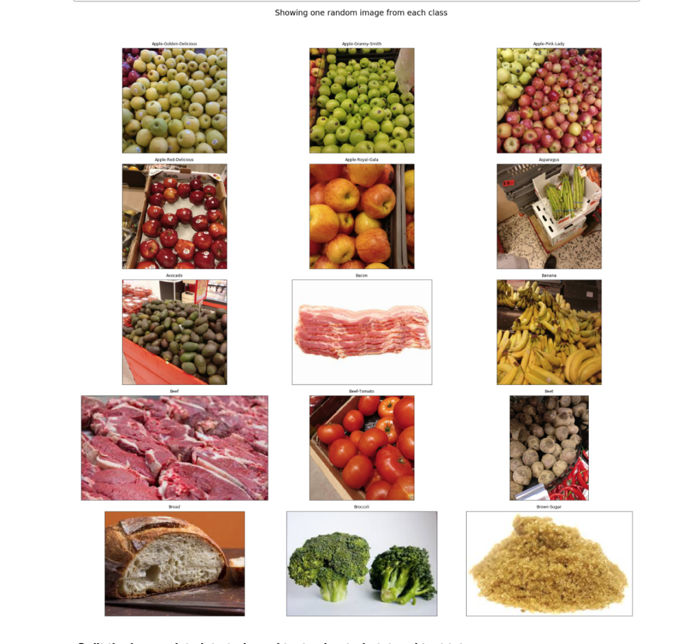
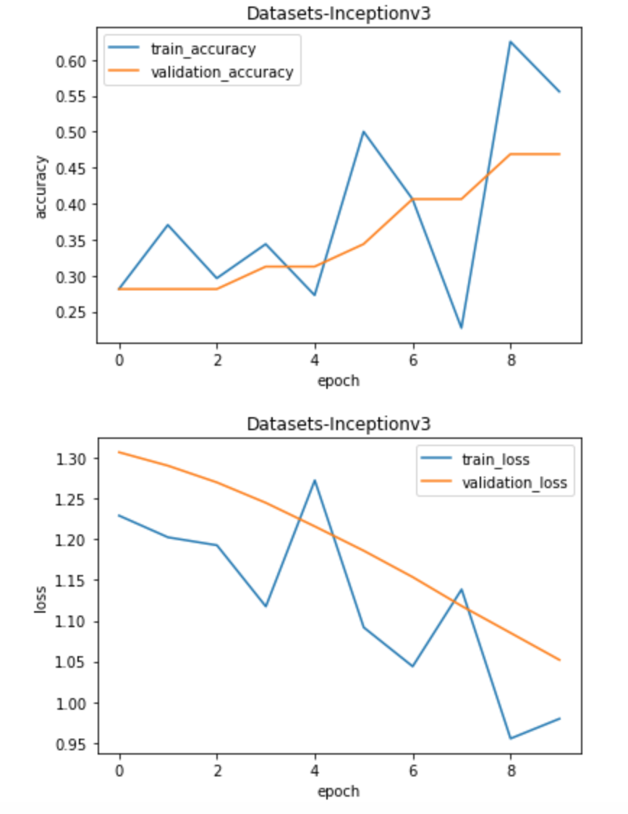
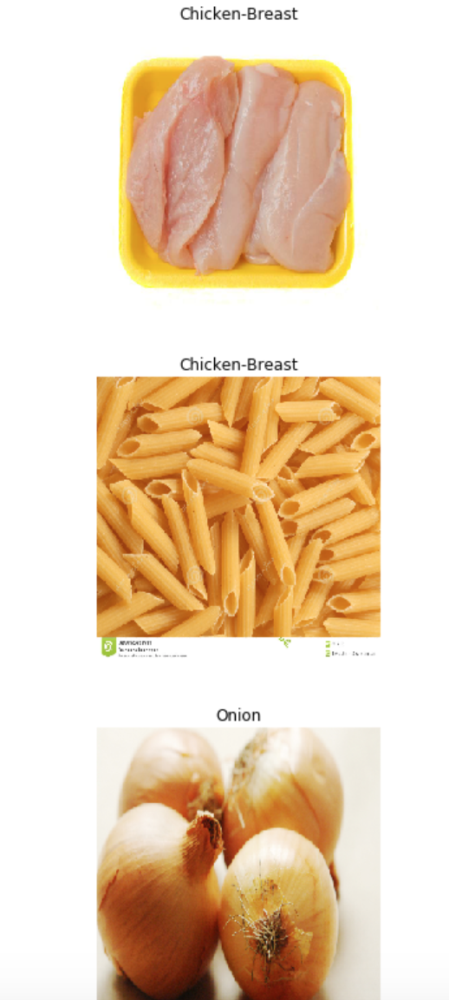
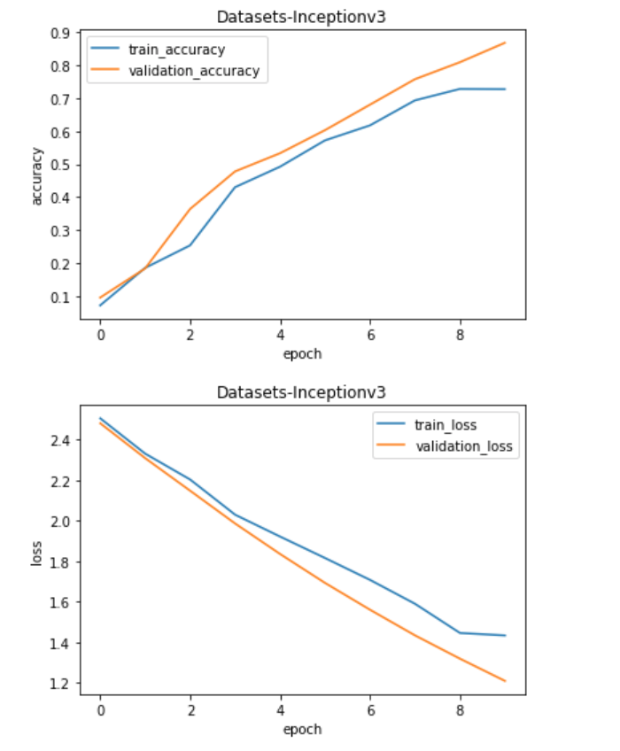
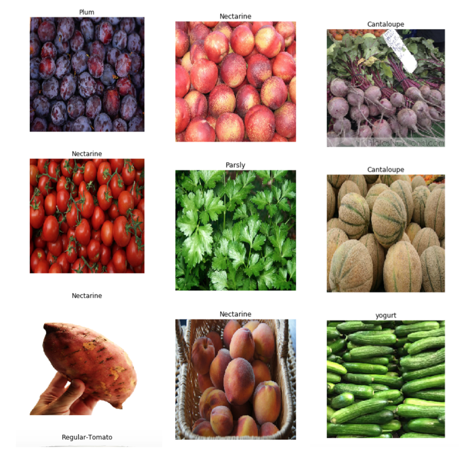

## Multiclass Classification using Keras and TensorFlow on Grocery Dataset
### What's for dinner?

### Project Description
Overview:

- Understand Grocery Dataset structure and files
- Visualize random image from each of the food classes
- Split the image data into train and test using train.txt and test.txt
- Create a subset of data with few classes(3) - train_mini and test_mini for experimenting
- Fine tune Inception Pretrained model using dataset
- Visualize accuracy and loss plots
- Predicting classes for new images from internet
- Scale up and fine tune Inceptionv3 model with 10 classes of data

### Fine tune Inception Pretrained model using our grocery dataset
Keras and other Deep Learning libraries provide pretrained models
These are deep neural networks with efficient architectures(like VGG,Inception,ResNet) that are already trained on datasets like ImageNet
Using these pretrained models, we can use the already learned weights and add few layers on top to finetune the model to our new data
This helps in faster convergance and saves time and computation when compared to models trained from scratch
We currently have a subset of dataset with 3 classes - Chicken-Breast, pasta and Onion
Use the below code to finetune Inceptionv3 pretrained model

### Fine tune Inceptionv3 model with 10 classes of data
- I trained a model on 3 classes and tested it using new data
- The model was able to predict the classes of all three test images correctly
- Will it be able to perform at the same level of accuracy for more classes?
- our Grocery Dataset has 122 classes of data
- But to check how the model performs when more classes are included, I'm using the same model to fine test and train on 10 randomly chosen classes

### Summary of the things I tried
- I used this very useful Keras blog - https://blog.keras.io/building-powerful-image-classification-models-using-very-little-data.html for reference
- I spent considerable amount of time in fixing things even before getting to the model training phase
  For example, it took some time to get the image visualization plots aligned withouth any overlap
- It is easier to go through a notebook and understand code someone else has taken hours to finish
- I started with VGG16 pretrained model. It did give good validation accuracy after training for few epochs
- I then tried Inceptionv3. VGG was taking more time for each epoch and since inception was also giving good validation      accuracy, I chose Inception over VGG
- I ran both VGG and Inception with two different image sizes - 150 X 50 and 299 X 299
- I had better results with larger image size and hence chose 299 X 299
- For data augmentation, I sticked to the transformations used in the above blog
- To avoid Colab connection issues during training, I set number of epochs to 10
- As the loss is still decreasing after 10 epochs both with 3-class and 10-class subset of data, the model can be trained for    some more epochs for better accuracy
